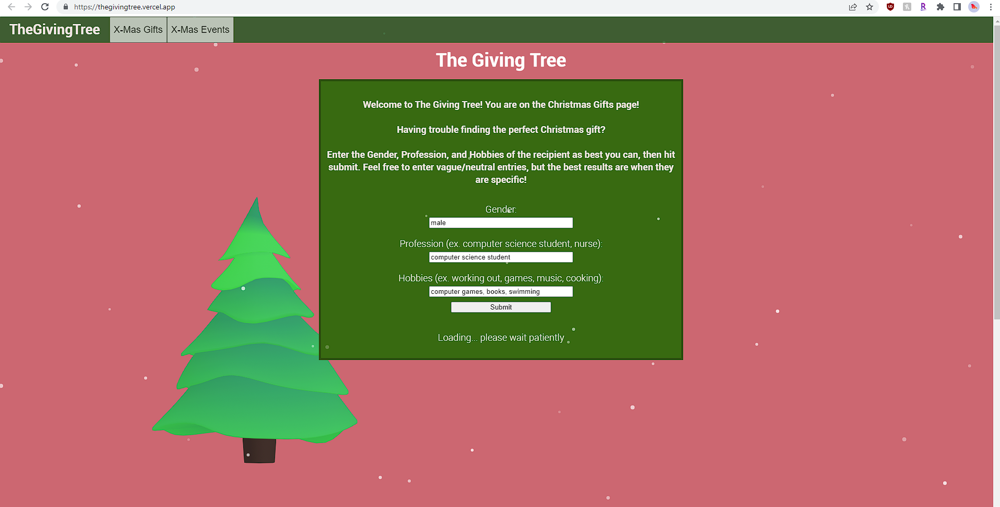
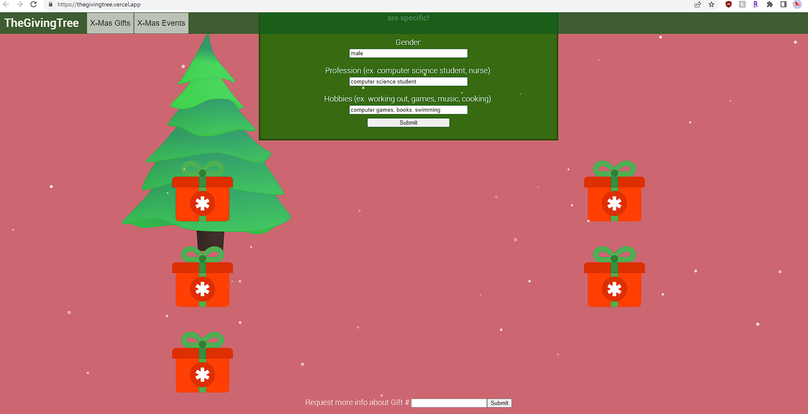
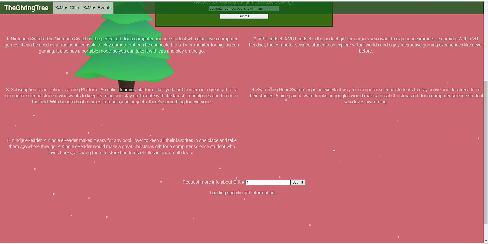
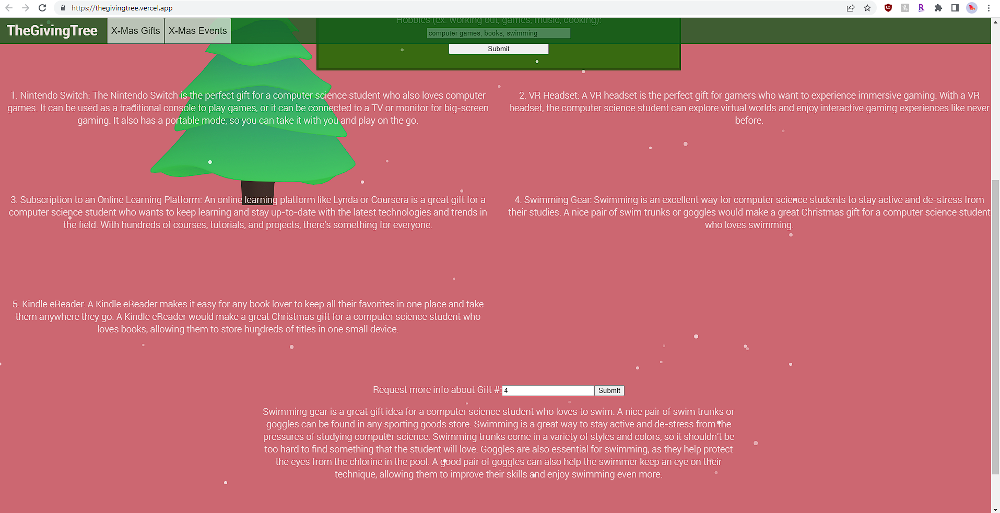
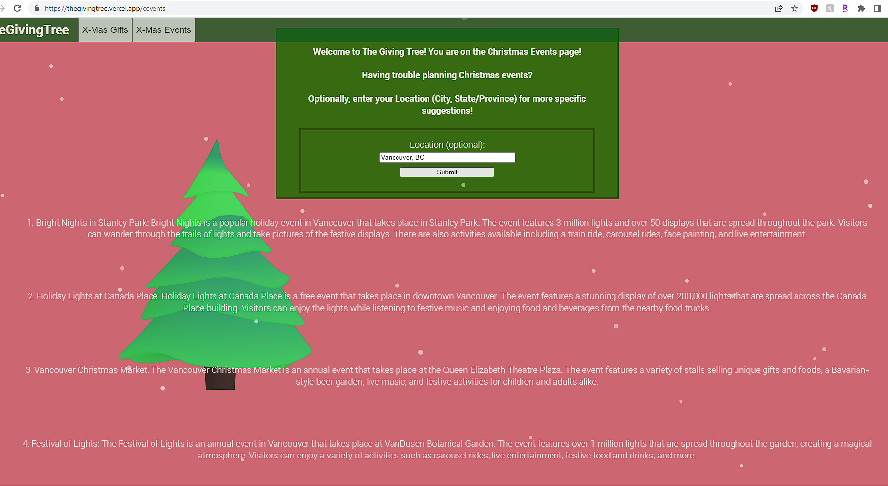
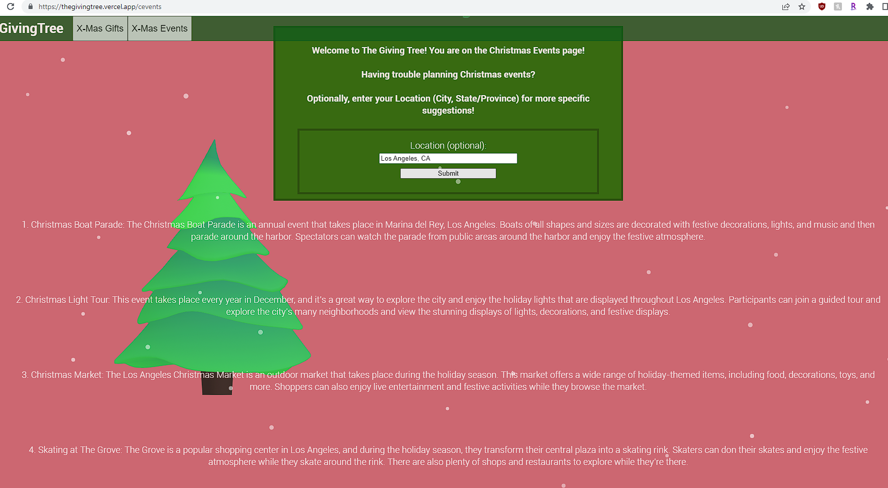
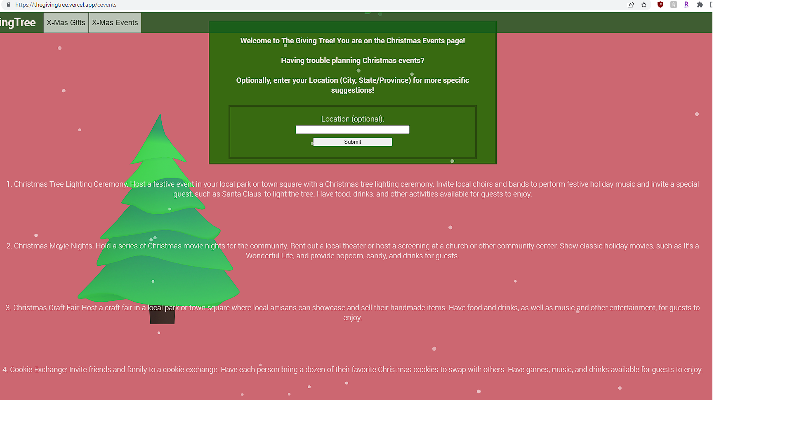

# The Giving Tree

This project utilize ChatGPT-3 AI technology from OpenAI to suggest gift suggestions and event ideas for various events (currently only Christmas). It was built using React.js, TypeScript, node.js, and Express.js. The frontend was deployed to Vercel, and the server was deployed to GCP via Container Registry and Cloud Run.

# How to Run

Visit the deployed website [here](https://thegivingtree.vercel.app/)

# What it does

This project utilizes the internet's current latest obsession, ChatGPT from Open AI, to suggest Christmas gifts or Christmas event ideas. 

The project website was also designed to be cozy, bright, and festive - to fit the Christmas / cool theme!

## Screenshots

*After inputting the recipient information, the website is fetching data from the server*

*Gift suggestions have been received! Click on the Gift Boxes to open them*

*After looking through all the gift ideas, you can enquire for further information about a specific gift number*

*Received more information about specific gift*

*Christmas Events ideas for Vancouver, BC*

*Christmas Event ideas for Los Angeles, CA*

General Christmas Events (No Location Provided)

*General Christmas Events (No Location Provided)*

# How we built it

The front end was built using React.js, TypeScript, HTML, and CSS. 

The server was built using node.js and Express.js, which fetched data from the ChatGPT API, which used the text-DaVinci-003 model. 

The front-end was hosted on Vercel, and the server was hosted on Google Cloud via a Docker Container was uploaded to Google Container Register, and ran with Google Cloud Run.

*Tech Stack:*

# Accomplishments that we're proud of

Although the project idea was fairly simple, I made it more interesting by trying out various new technologies that I have always wanted to try.

I had always wanted to use OpenAI products. Seeing how powerful the model was, first-hand, was quite impressive.

I also took the chance to break out of my comfort zone to transition from JavaScript to TypeScript. I have learned a bit of TS before, but this was my first time creating a larger-scale and deployed product using TS. 

Lastly, I was able to use Google Cloud via  Container Registery and Cloud Run to deploy the server. I am proud of this since it was also my first time deploying using a Docker container, and first time really diving into Googe Cloud products. I was amazed at the ease of process and speed of deployment.

# Challenges we ran into

As I am more comfortable with JavaScript, transitioning to TypeScript and learning new syntax was a big challenge. I spent a lot of time working on the CSS portion since a large part of the project went into the cozy/Christmas theme design of the website itself. The timing of the project was also a challenge since it was scheduled on Christmas Eve.

# What we learned

- TypeScript - I plan to use more and more of this in my future projects.
- Docker & Google Cloud Deployment - will use this more if I need to deploy future projects
- OpenAI/ChatGPT - very strong AI model
- CSS Animations, SplineJS - useful for creating a cozy website design atmosphere

# What's next for The Giving Tree

I left the name "The Giving Tree" to be fairly open-ended. The name does not specify that it needed to be Christmas gifts or events. So I do plan on creating gift/event suggestions for other occasions such as Valentines Day, Birthdays, and Halloween. 

Next would be to optimize the input and server backend... would be nice to have more input variety rather than just gender, profession, and hobbies.

Lastly, making the website look nicer via mobile-responsiveness and better CSS, maybe using a library would be a good next step.
